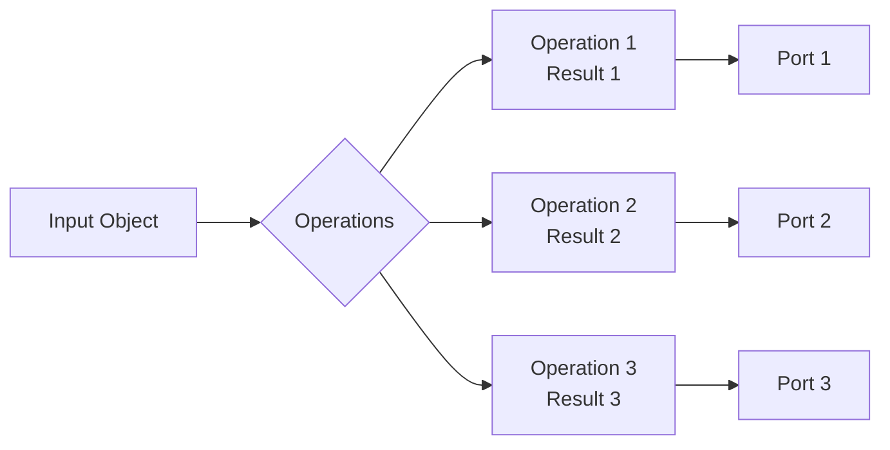

# node-red-contrib-transform-switch

A Node-RED node that combines data transformation and flow routing. It allows you to apply multiple operations to a single input and route the results to different output ports.

## The Problem

Using standard `change` nodes often requires transforming the same field into various results. As the number of these intermediate "mapping" operations increases, the flow becomes cluttered with numerous components. While moving these into sub-flows is a possible workaround, it merely delegates the complexity rather than solving the underlying structural issue.

### Example


## The Idea

The `transform-switch` node integrates the logic of `change` (transformation) and `switch` (conditional routing) nodes into a single component.

### Visual Representation



## Pros
- **Scalability and Readability**: Improves flow clarity when multiple simple operations are performed on the same input object to distribute results.

## Cons
- **Limited to Simple Logic**: Due to its abstraction as a combination of two basic components, it is not suitable for highly complex logic.

---

## Installation

```bash
npm i ~/path/to/package
```
